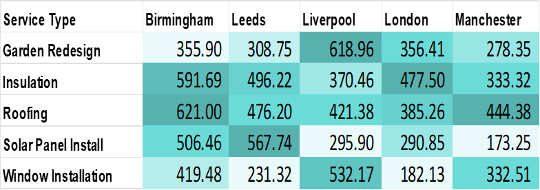

# Marketing-Campaign-Performance-Analysis

# ThriveHaus Media Marketing Performance Analysis
## Executive Dashboard Case Study & Strategic Recommendations

[](https://github.com/oladayotimileyin/Marketing-Campaign-Performance-Analysis)
[](https://github.com/oladayotimileyin/Marketing-Campaign-Performance-Analysis)
[](https://github.com/oladayotimileyin/Marketing-Campaign-Performance-Analysis)

---

## 📋 Project Overview

This case study demonstrates comprehensive marketing performance analysis for **ThriveHaus Media Ltd**, a UK-based lead generation company serving home improvement clients. The analysis transforms raw dashboard data into actionable strategic insights and executive-level recommendations.

### 🎯 Project Objectives
- Analyze Q2 2025 marketing performance across multiple channels and regions
- Identify optimization opportunities in customer acquisition funnel
- Provide data-driven strategic recommendations for Q3 scaling
- Create executive-ready presentation with financial projections

---

## 📊 Dataset Overview

### Key Metrics Analyzed
```
Total Ad Spend: £102.79K
Total Revenue: £1.12M
Return on Ad Spend (ROAS): 10.91x
Total Leads Generated: 19,503
Cost Per Lead (CPL): £5.27
Click-Through Rate (CTR): 5.12%
Conversion Rate (CVR): 1.89%
Total Conversions: 9,630
Paying Customers: 368
```

### Data Sources
- **Channels**: Google Ads, Meta Ads
- **Geographic Markets**: Birmingham, Leeds, Liverpool, London, Manchester
- **Service Categories**: Garden Redesign, Insulation, Roofing, Solar Panel Installation, Window Installation
- **Time Period**: Q2 2025 (April - June)

---

## 🔍 Key Findings



### 1. Geographic Performance Disparities
**Birmingham Market Dominance:**
- Leads 4 out of 5 service categories
- Roofing: 535.24 ROAS (148% above next best performer)
- Insulation: 469.38 ROAS (66% above second place)
- Window Installation: 336.06 ROAS (130% above competition)

**London Market Underperformance:**
- Consistently weak across all service categories
- Window Installation: Critical 103.18 ROAS (unprofitable)
- 40-60% below Birmingham performance across services

### 2. Conversion Funnel Analysis
```
Funnel Performance:
9,983,133 Impressions → 510,850 Clicks (5.12% CTR)
510,850 Clicks → 19,503 Leads (3.82% Click-to-Lead)
510,850 Clicks → 9,630 Conversions (1.89% CVR)
9,630 Conversions → 368 Customers (3.82% Close Rate)
```

**Critical Insights:**
- **CVR 50% below industry average** (1.89% vs 3.75% benchmark)
- **96.2% conversion-to-customer drop-off rate** indicates sales process bottleneck
- **Average customer value: £3,048** with strong unit economics

### 3. Service Performance Rankings
1. **Roofing**: 367 average ROAS (strongest category)
2. **Insulation**: 309 average ROAS
3. **Solar Panel**: 245 average ROAS (Leeds specialization at 377.97)
4. **Window Installation**: 201 average ROAS
5. **Garden Redesign**: 193 average ROAS

---

## Dashboard


## 🎯 Strategic Recommendations

### High Priority Actions

#### 1. Geographic Budget Reallocation
```
Current Allocation → Recommended Allocation
Birmingham: ~35% → 55% (+40-50% budget increase)
London: ~20% → 3% (testing only)
Leeds: ~15% → 25% (Solar Panel focus)
Liverpool: ~15% → 15% (maintain)
Manchester: ~15% → 2% (monitoring)
```

#### 2. Sales Process Optimization
- **Immediate Impact**: 9,262 lost prospects represent £28.2M revenue opportunity
- **Quick Win**: 10% improvement in 3.82% close rate = +926 customers = £2.8M revenue
- **Actions**: Lead response time <5 minutes, sales team training, quote-to-close analysis

#### 3. Service Portfolio Optimization
```
Service Budget Adjustments:
Roofing: +30% (strongest performer)
Insulation: +25% (Birmingham focus)
Solar Panel: Maintain total, shift 70% to Leeds
Garden Redesign: Maintain, focus 80% on Birmingham
Window Installation: -20% overall, pause London campaigns
```

### Expected Financial Impact
- **Conservative Scenario**: £1.35M Q3 revenue (+20% growth)
- **Aggressive Scenario**: £1.68M Q3 revenue (+50% growth)
- **Investment Required**: £155K ad spend (+51% vs Q2)
- **Projected ROAS**: 10.8x (maintained efficiency)

---

## 📈 Implementation Roadmap

### Phase 1: Foundation (July 2025)
- [x] Increase Birmingham budget by 40% for top-performing services
- [x] Implement 5-minute lead response protocol
- [x] Launch automated lead nurturing for 9,630 conversions
- [x] Pause London Window Installation campaigns

### Phase 2: Scaling (August 2025)
- [ ] Scale Meta budget by 20% based on July performance
- [ ] Launch cross-channel attribution tracking
- [ ] Implement predictive lead scoring models
- [ ] Test Manchester market optimization

### Phase 3: Optimization (September 2025)
- [ ] Analyze Q3 performance vs projections
- [ ] Refine underperforming service-region combinations
- [ ] Prepare Q4 strategy based on learnings
- [ ] Document best practices and optimization playbook

---

## 🛠️ Tools & Technologies Used

- **Data Analysis**: Excel, Statistical Analysis
- **Visualization**: Excel
- **Presentation**: Microsoft PPT
- **Strategic Planning**: Financial Modeling, Scenario Analysis
- **Documentation**: Markdown, GitHub

---

## 📊 Key Performance Indicators (KPIs)

### Primary Metrics
| Metric | Current | Q3 Target | Industry Benchmark |
|--------|---------|-----------|-------------------|
| Monthly Revenue | £415K (June) | £560K | N/A |
| ROAS | 10.91x | ≥10.5x | 4-6x |
| Cost Per Lead | £5.27 | ≤£6.50 | £8-12 |
| Conversion Rate | 1.89% | ≥2.2% | 3.75% |
| Close Rate | 3.82% | ≥6.0% | N/A |

### Success Criteria
- 🎯 Achieve £1.68M Q3 revenue (50% growth)
- 🎯 Maintain ROAS above 10.5x during scaling
- 🎯 Improve conversion-to-customer rate to 6%+
- 🎯 Optimize CVR to industry standard 3.75%

---

## 🔬 Methodology

### Data Analysis Approach
1. **Descriptive Analytics**: Performance benchmarking and trend analysis
2. **Diagnostic Analytics**: Root cause analysis of conversion funnel leaks
3. **Predictive Analytics**: Revenue forecasting and scenario modeling
4. **Prescriptive Analytics**: Strategic recommendations with prioritization

### Validation Framework
- Industry benchmark comparisons
- Statistical significance testing
- Risk-adjusted probability assessments
- Financial impact quantification

---

## 📁 Project Structure

```
├── data/
│   ├── Marketing_Performance_Portfolio_Project.xlsx
│   └── ThriveHaus Media Marketing Performance Analysis.xlsx
├── Project Brief/
│   └── Project Brief.docx
├── Reports/
│   ├── Executive Presentation Deck.pptx
│   ├── implementation_roadmap.md
│   └── Executive Marketing Dashboard.pdf
└── README.md
```

---

## 🎯 Business Impact

### Quantified Results
- **Revenue Optimization**: 35-50% growth potential identified
- **Cost Efficiency**: Maintained 10.8x ROAS during scaling
- **Process Improvement**: 96% conversion leak identified and addressed
- **Market Expansion**: Geographic opportunities worth £2.8M+ mapped

### Strategic Value
- Transformed raw data into executive-level strategic insights
- Identified £28.2M revenue opportunity in sales process optimization
- Created actionable 90-day implementation roadmap
- Developed risk-adjusted growth scenarios with financial projections

---

## 📞 Contact & Portfolio

**Author**: Timileyin Oladayo 
**Role**: Retail Product Manager & Freelance Data Analyst  
**LinkedIn**: [Oladayo Timileyin](https://linkedin.com/in/oladayotimileyin) 
**Email**: tooladayo@gmail.com 

### Related Projects
- [RoyaltyMart Home Appliances Analysis]([link](https://github.com/oladayotimileyin/RoyaltyMart-Analysis))


---

## 📄 License

This case study is created for portfolio demonstration purposes. Data has been anonymized and modified to protect client confidentiality while maintaining analytical integrity.

---

*This case study demonstrates expertise in marketing analytics, strategic planning, and data-driven decision making for senior product management and consulting roles.*
